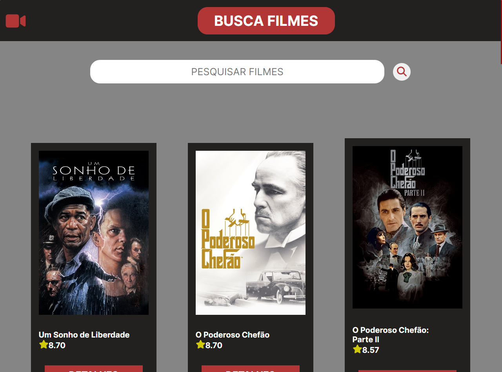
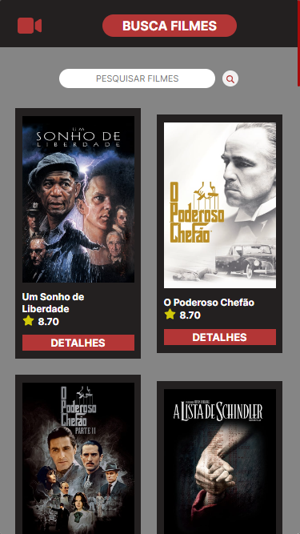

# Projeto "Busca Filmes" - Meu Primeiro Projeto

Este é o repositório do projeto "Busca Filmes", um aplicativo web desenvolvido em React. O aplicativo permite aos usuários explorar uma vasta coleção de filmes, visualizar detalhes sobre filmes específicos e pesquisar filmes por título.

## Índice

- [Visão geral](#visão-geral)
   - [O desafio](#o-desafio)
   - [Captura de tela](#captura-de-tela)
- [Meu processo](#meu-processo)
   - [Construído com](#construído-com)
   - [O que aprendi](#o-que-aprendi)
- [Autor](#autor)

## Visão geral

### O desafio
Este é um projeto pessoal totalmente desenvolvido por mim, desde: Desing(ultilizando Figma) e codigo.
O aplicativo permite aos usuários explorar uma vasta coleção de filmes, visualizar detalhes sobre filmes específicos e pesquisar filmes por título.

Funcionalidades Principais
- Visualização de Filmes Populares: Os usuários podem explorar uma lista dos filmes mais populares do momento.

- Detalhes do Filme: Ao selecionar um filme, os usuários podem visualizar detalhes como sinopse, elenco, gêneros e até mesmo informações sobre onde assistir o filme.

- Pesquisa de Filmes: Os usuários podem pesquisar filmes específicos utilizando a funcionalidade de pesquisa integrada.

### Captura de tela

### DESKTOP


### TABLET


### MOBILE


## Meu processo

### Tecnologias Utilizadas

- React: Utilizei o framework React para construir a interface do usuário, garantindo uma experiência dinâmica e responsiva.

- React Router: Utilizei o React Router para gerenciar as rotas da aplicação, possibilitando a navegação entre diferentes páginas de forma suave.

- React Hooks: Uma característica do React que permite usar state e effect entre outros recursos do React em componentes de função, simplificando o código e facilitando o compartilhamento de lógica entre componentes.

- API do The Movie Database (TMDb): Esta API fornece acesso a uma vasta coleção de informações sobre filmes, incluindo detalhes, imagens e trailers.

- CSS: Utilizei CSS puro para estilizar a aplicação e garantir uma experiência visualmente atraente e coesa. Assim como Flexbox e Grid, mesclando os dois para fazer um layout dinamico

- Metodos, exportamento e importamneto de funções e componentes em JavaScript e React para a interação

- Uso do arquivo .env para armazenar variaveis de ambiente

- Manipulação do DOM


### O que eu aprendi

Aperfeçoei bastante minhas habilidades em JavaScript e cada vez que estudo mais afundo sobre essa linguagem eu me surpreendo mais com quão diversificada ela é, outro ponto que aperfeiçoei seria meus conhecimentos em APIs, como tudo funciona, requisições HTTP como: FECHT, POST, GET, como ler as documentações não só de APIs mas também de bibliotecas e da propria linguagem em sí, oque é e para que serve o arquivo .env para seu projeto. Por ultimo e não menos importante, REACT, acho que oque eu mais aprendi nisso tudo foi sobre React. Esse é meu primeiro projeto usando React então tudo é muito novo para mim, tive que quebrar bastante a cabeça para entender como cada coisa funciona, o porque essa coisa é assim, tive que ler bastante a documentação e ver bastante videos sobre oque é o React e quais suas funcionalidades, suas caracteristicas e sua sintaxe.

```jsx
import { useEffect, useState } from 'react'
import { useParams } from 'react-router-dom'

import { FontAwesomeIcon } from '@fortawesome/react-fontawesome'
import { faStar, faClock } from '@fortawesome/free-solid-svg-icons'

import '../css/movie_cards/movie_card.css'
import '../css/responsive/movie_card_responsive.css'

const urlMovies = import.meta.env.VITE_API
const apiKey = import.meta.env.VITE_API_KEY
const apiImg = import.meta.env.VITE_IMG

const Movie = () => {

  const { id } = useParams()
  const [filme, setFilme] = useState()
  const [streaming, setStreaming] = useState()
  const [credits, setCredits] = useState()

  async function Filme() {
    const url = `${urlMovies}${id}?${apiKey}&language=pt-BR&append_to_response=videos,images`
    const response = await fetch(url)
    const data = await response.json()

    setFilme(data)
  }

  async function Streaming() {
    const url = `${urlMovies}${id}/watch/providers?${apiKey}`
    const response = await fetch(url)
    const data = await response.json()

    setStreaming(data.results.BR)
  }

  async function Credits() {
    const url = `${urlMovies}${id}/credits?${apiKey}`
    const response = await fetch(url)
    const data = await response.json()

    setCredits(data)
  }

  useEffect(() => {
    Filme()
    Streaming()
    Credits()
  }, [])

  
```
## NOTA:

- Futuramente vou estar mexendo neste projeto de novo e vou dar umas atualizadas nele, como por exemplo da uma simplifica e organizar melhor o codigo, adicionar novas funcionalidades como: não ficar restrito somente em filmes e mostrar também series, filtro se no caso usuario so queira pesquisar series, expandir para outros idiomas e melhorar o layout

## Autor

- Linkedin - [Luis Fernando Macedo](https://www.linkedin.com/in/luis-fernando-macedo-7791ba219)
- Instagram - [Luis Fernando](https://www.instagram.com/luis._.fernand0_)